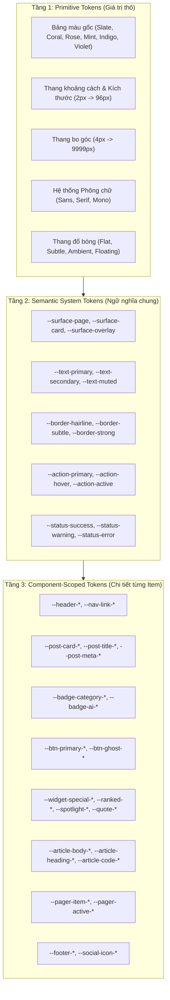

# ĐẶC TẢ KỸ THUẬT: HỆ THỐNG CSS DESIGN TOKENS & CHUẨN HÓA KIẾN TRÚC GIAO DIỆN TOÀN DIỆN (COMPREHENSIVE CSS DESIGN TOKENS ARCHITECTURE SPECIFICATION)

> **Mã đặc tả**: `SPEC-CSS-DESIGN-TOKENS-V1`  
> **Dự án**: Blogger Editorial Theme (Blogspot XML v3)  
> **Phiên bản**: `v1.0.0`  
> **Trạng thái**: Hoàn thiện thiết kế kỹ thuật (Ready for Implementation)  
> **Tài liệu tham chiếu**: [THEME_SPECIFICATION.md](file:///Users/nam.truong/Documents/Viber%20Coding/blogspot-editorial-theme/specs/THEME_SPECIFICATION.md), [HOMEPAGE_INTERLEAVED_WIDGETS_AND_LAYOUT_SPECIFICATION.md](file:///Users/nam.truong/Documents/Viber%20Coding/blogspot-editorial-theme/specs/HOMEPAGE_INTERLEAVED_WIDGETS_AND_LAYOUT_SPECIFICATION.md), [AI_TRANSPARENCY_SPECIFICATION.md](file:///Users/nam.truong/Documents/Viber%20Coding/blogspot-editorial-theme/specs/AI_TRANSPARENCY_SPECIFICATION.md)

---

## 1. TỔNG QUAN & NGUYÊN TẮC KIẾN TRÚC (ARCHITECTURAL PHILOSOPHY)

### 1.1. Mục tiêu cốt lõi
1. **Khả năng tùy biến tối đa (Maximal Customizability)**: Tách rời hoàn toàn cấu trúc HTML/XML khỏi phong cách thị giác. Cho phép thay đổi toàn bộ diện mạo của blog (từ *Minimalist Hairline*, *Pastel Gradient*, đến *Classic Editorial Serif* hoặc *Tech Monokai*) chỉ bằng việc thay đổi bộ biến số, không cần can thiệp vào logic template hay cấu trúc thẻ.
2. **Kiến trúc phân tầng 3 lớp (3-Tier Token Hierarchy)**:
   - **Tầng 1 - Primitive Tokens**: Giá trị thô (Mã Hex màu cơ bản, font-family, thang đo kích thước, khoảng cách chuẩn).
   - **Tầng 2 - Semantic System Tokens**: Giá trị theo ngữ cảnh hệ thống (Nền mặt phẳng, màu chữ chính/phụ, viền mảnh hairline, hiệu ứng tương tác).
   - **Tầng 3 - Component & Item-Level Tokens**: Biến số chi tiết đến từng thành phần con của mọi widget/khối UI trên trang.
3. **Hiệu suất & Không giật hình (Zero-FOUC & Pure Native CSS)**:
   - 100% sử dụng **Native CSS Custom Properties** (`var(--token)`), hỗ trợ Dark Mode tức thì không cần JavaScript render lại giao diện.
   - Dễ dàng tích hợp vào công cụ **Blogger Theme Designer** (`<b:skin>`).

---

## 2. KIẾN TRÚC PHÂN TẦNG DESIGN TOKENS (TOKEN HIERARCHY)



---

## 3. CHI TIẾT TẦNG 1 & 2: PRIMITIVE & SEMANTIC TOKENS

### 3.1. Thang đo Kích thước, Bo góc & Đường nét (Spacing, Radius, Stroke)
```css
:root {
  /* Spacing Scale */
  --space-3xs: 2px;
  --space-2xs: 4px;
  --space-xs:  8px;
  --space-sm:  12px;
  --space-md:  16px;
  --space-lg:  24px;
  --space-xl:  32px;
  --space-2xl: 48px;
  --space-3xl: 64px;

  /* Radius Scale */
  --radius-none: 0px;
  --radius-xs:   4px;
  --radius-sm:   6px;
  --radius-md:   10px;
  --radius-lg:   14px;
  --radius-xl:   20px;
  --radius-2xl:  28px;
  --radius-full: 9999px;

  /* Stroke Weights */
  --stroke-hairline: 1px;
  --stroke-medium:   1.5px;
  --stroke-thick:    2px;
  --icon-stroke-default: 1.5px;
}
```

### 3.2. Chuẩn mực Đường nét (Hairline Borders) & Bóng mờ (Ambient Shadows)
> **Nguyên tắc vàng Hairline**: Sử dụng kênh màu trong suốt (`rgba`) để viền hòa quyện vào màu nền, tạo độ tương phản cực kỳ êm dịu, không đóng hộp cứng nhắc.

```css
:root {
  /* Light Mode Semantic Borders */
  --border-hairline: rgba(15, 23, 42, 0.06);     /* Viền siêu mảnh, mắt lướt êm */
  --border-subtle:   rgba(15, 23, 42, 0.10);     /* Viền phân định khối vừa */
  --border-divider:  rgba(15, 23, 42, 0.04);     /* Đường kẻ ngăn cách giữa các dòng */
  --border-focus:    rgba(255, 107, 107, 0.45);   /* Vòng viền khi active/focus */

  /* Light Mode Semantic Shadows (Tán xạ tự nhiên, không đen đặc) */
  --shadow-none:     none;
  --shadow-hairline: 0 1px 2px 0 rgba(0, 0, 0, 0.02);
  --shadow-ambient:  0 4px 20px -2px rgba(15, 23, 42, 0.04);
  --shadow-float:    0 12px 32px -4px rgba(15, 23, 42, 0.08);
  --shadow-glow:     0 0 20px -2px rgba(255, 107, 107, 0.25);
}

[data-theme="dark"] {
  /* Dark Mode Semantic Borders */
  --border-hairline: rgba(255, 255, 255, 0.08);
  --border-subtle:   rgba(255, 255, 255, 0.14);
  --border-divider:  rgba(255, 255, 255, 0.05);
  --border-focus:    rgba(255, 107, 107, 0.60);

  /* Dark Mode Shadows */
  --shadow-ambient:  0 4px 20px -2px rgba(0, 0, 0, 0.45);
  --shadow-float:    0 12px 32px -4px rgba(0, 0, 0, 0.65);
  --shadow-glow:     0 0 24px -2px rgba(255, 107, 107, 0.35);
}
```

---

## 4. CHI TIẾT TẦNG 3: COMPONENT & ITEM-LEVEL DESIGN TOKENS

Đây là tầng chuẩn hóa chi tiết nhất, bao phủ **toàn bộ các thành phần hiển thị trên giao diện**. Mọi thuộc tính CSS của component đều liên kết trực tiếp với các token này để phục vụ mục tiêu **tùy biến tối đa**.

### 4.1. Header & Navigation Bar (`.site-header`, `.nav-item`, `.mobile-nav`)
| Item Token | Kiểu giá trị | Mô tả công dụng | Giá trị mặc định (Light) |
| :--- | :--- | :--- | :--- |
| `--header-height` | Kích thước | Chiều cao thanh điều hướng chính | `64px` |
| `--header-bg` | Màu / RGBA | Màu nền thanh header (hỗ trợ backdrop glass) | `rgba(255, 255, 255, 0.82)` |
| `--header-blur` | Bộ lọc | Độ mờ nền kính phía sau header | `blur(12px)` |
| `--header-border-bottom` | Border | Viền chân header ngăn cách nội dung | `var(--stroke-hairline) solid var(--border-hairline)` |
| `--header-logo-font` | Font | Phông chữ cho Logo Blog | `var(--font-heading)` |
| `--header-logo-size` | Kích thước | Cỡ chữ logo | `1.25rem` |
| `--header-logo-color` | Màu sắc | Màu chữ logo thương hiệu | `var(--text-primary)` |
| `--nav-link-color` | Màu sắc | Màu chữ liên kết điều hướng tĩnh | `var(--text-secondary)` |
| `--nav-link-color-hover`| Màu sắc | Màu chữ khi trỏ chuột vào link | `var(--action-primary)` |
| `--nav-link-bg-hover` | Màu sắc | Nền nhẹ khi hover vào menu item | `rgba(0, 0, 0, 0.03)` |
| `--nav-link-radius` | Bo góc | Bo tròn khi hover vào menu | `var(--radius-md)` |
| `--nav-active-bar-height`| Kích thước | Độ dày vạch chỉ thị mục menu đang mở | `2px` |
| `--nav-active-bar-bg` | Gradient/Màu| Dải màu vạch chỉ thị menu đang mở | `var(--primary-gradient)` |
| `--search-btn-size` | Kích thước | Đường kính nút mở kính lúp tìm kiếm | `36px` |
| `--search-btn-border` | Border | Viền nút kính lúp | `var(--stroke-hairline) solid var(--border-hairline)` |
| `--theme-toggle-size` | Kích thước | Đường kính nút chuyển Dark/Light mode | `36px` |

---

### 4.2. Post Card & Feed Danh sách Bài viết (`.post-card`, `.posts-feed`)
| Item Token | Kiểu giá trị | Mô tả công dụng | Giá trị mặc định |
| :--- | :--- | :--- | :--- |
| `--post-card-bg` | Màu sắc | Màu nền của thẻ bài viết | `var(--surface-card)` |
| `--post-card-border` | Border | Viền thẻ bài viết (Hairline chuẩn) | `var(--stroke-hairline) solid var(--border-hairline)` |
| `--post-card-border-hover`| Border | Viền thẻ khi hover (Tương tác tinh tế) | `var(--stroke-hairline) solid var(--border-subtle)` |
| `--post-card-radius` | Bo góc | Độ cong góc thẻ bài viết | `var(--radius-xl)` |
| `--post-card-padding` | Khoảng cách | Đệm trong của thẻ bài viết | `1.5rem` |
| `--post-card-shadow` | Shadow | Đổ bóng tĩnh của thẻ bài viết | `var(--shadow-hairline)` |
| `--post-card-shadow-hover`| Shadow | Đổ bóng khi rê chuột (Nâng nhẹ thẻ lên) | `var(--shadow-ambient)` |
| `--post-card-hover-y` | Dịch chuyển | Độ nảy thẻ bài viết khi hover | `-3px` |
| `--post-thumb-width` | Kích thước | Chiều rộng ảnh thumbnail bài viết | `220px` (Desktop) |
| `--post-thumb-ratio` | Tỷ lệ | Tỷ lệ khung hình thumbnail | `16 / 10` |
| `--post-thumb-radius` | Bo góc | Độ cong góc ảnh bài viết | `var(--radius-lg)` |
| `--post-thumb-filter` | Filter | Hiệu ứng trên ảnh khi tĩnh | `saturate(0.98)` |
| `--post-thumb-filter-hover`| Filter | Hiệu ứng trên ảnh khi hover | `saturate(1.08) scale(1.02)` |
| `--post-title-color` | Màu sắc | Màu tiêu đề bài viết | `var(--text-primary)` |
| `--post-title-color-hover`| Màu sắc | Màu tiêu đề khi rê chuột vào | `var(--action-primary)` |
| `--post-title-font` | Font | Phông chữ tiêu đề | `var(--font-heading)` |
| `--post-title-size` | Cỡ chữ | Cỡ chữ tiêu đề trong feed | `1.25rem` |
| `--post-title-line-height`| Tỷ lệ | Độ giãn dòng tiêu đề | `1.4` |
| `--post-snippet-color` | Màu sắc | Màu văn bản tóm tắt trích đoạn | `var(--text-secondary)` |
| `--post-snippet-size` | Cỡ chữ | Cỡ chữ trích đoạn bài viết | `0.925rem` |
| `--post-snippet-lines` | Số dòng | Số dòng tóm tắt tối đa hiển thị | `2` (`-webkit-line-clamp`) |
| `--post-meta-color` | Màu sắc | Màu thông tin phụ (ngày đăng, tác giả) | `var(--text-muted)` |
| `--post-meta-size` | Cỡ chữ | Cỡ chữ thông tin ngày tháng | `0.8125rem` |
| `--post-meta-icon-size`| Kích thước | Kích thước icon metadata | `14px` |

---

### 4.3. Badges, Category Labels & Tags (`.post-badge`, `.category-pill`)
> Cho phép tùy biến hoàn toàn hiệu ứng **Pastel Gradient** và viền hairline siêu mảnh:

| Item Token | Kiểu giá trị | Mô tả công dụng | Giá trị mặc định (Light) |
| :--- | :--- | :--- | :--- |
| `--badge-bg-gradient` | Gradient/Màu| Nền chuyển sắc của nhãn danh mục | `linear-gradient(135deg, rgba(255, 107, 107, 0.1) 0%, rgba(255, 159, 67, 0.1) 100%)` |
| `--badge-border` | Border | Viền nhãn danh mục (Hairline pastel) | `1px solid rgba(255, 107, 107, 0.22)` |
| `--badge-text-color` | Màu sắc | Màu chữ của nhãn (Tông sẫm tương phản) | `#d93838` (WCAG AA) |
| `--badge-radius` | Bo góc | Bo tròn kiểu viên thuốc (Pill shape) | `var(--radius-full)` |
| `--badge-padding-y` | Khoảng cách | Đệm dọc của nhãn | `4px` |
| `--badge-padding-x` | Khoảng cách | Đệm ngang của nhãn | `10px` |
| `--badge-font-size` | Cỡ chữ | Kích thước phông chữ nhãn | `0.72rem` |
| `--badge-font-weight` | Độ đậm | Độ dày nét chữ nhãn | `700` |
| `--badge-letter-spacing`| Khoảng cách | Giãn cách ký tự hoa | `0.05em` |
| `--badge-text-transform`| Chuyển đổi | In hoa hoặc giữ nguyên | `uppercase` |
| `--badge-hover-scale` | Tỷ lệ nảy | Hiệu ứng phóng to nhẹ khi hover | `scale(1.04)` |

---

### 4.4. Buttons & Nút Bấm Tương Tác (`.btn`, `.btn-primary`, `.btn-secondary`)
| Item Token | Kiểu giá trị | Mô tả công dụng | Giá trị mặc định |
| :--- | :--- | :--- | :--- |
| `--btn-primary-bg-gradient`| Gradient | Nền nút bấm kêu gọi hành động chính (CTA) | `linear-gradient(135deg, #ff6b6b 0%, #ff8e53 100%)` |
| `--btn-primary-text-color` | Màu sắc | Màu chữ nút chính (Độ tương phản cao) | `#ffffff` |
| `--btn-primary-border` | Border | Viền nút chính | `none` |
| `--btn-primary-radius` | Bo góc | Độ cong góc nút chính | `var(--radius-md)` |
| `--btn-primary-shadow` | Shadow | Bóng đổ hào quang màu pastel (Glow effect) | `0 4px 14px 0 rgba(255, 107, 107, 0.35)` |
| `--btn-primary-shadow-hover`| Shadow | Bóng hào quang rực rỡ hơn khi hover | `0 6px 20px 0 rgba(255, 107, 107, 0.48)` |
| `--btn-secondary-bg` | Màu sắc | Nền nút phụ | `var(--surface-surface)` |
| `--btn-secondary-text` | Màu sắc | Màu chữ nút phụ | `var(--text-primary)` |
| `--btn-secondary-border` | Border | Viền nút phụ | `var(--stroke-hairline) solid var(--border-hairline)` |
| `--btn-ghost-bg-hover` | Màu sắc | Nền nút trong suốt khi rê chuột | `rgba(0, 0, 0, 0.04)` |
| `--btn-font-weight` | Độ đậm | Độ đậm phông chữ nút bấm | `600` |
| `--btn-padding-y` | Khoảng cách | Chiều cao đệm dọc nút | `10px` |
| `--btn-padding-x` | Khoảng cách | Chiều rộng đệm ngang nút | `20px` |

---

### 4.5. Special Posts Widgets (6 Mẫu Widget Xen Kẽ & Cố Định)
Bao gồm các biến cho: `ranked`, `spotlight`, `quote`, `digest`, `video`, `slideshow`.

#### A. Mẫu Ranked (Xếp hạng 1-2-3-4-5)
- `--ranked-item-gap`: `1rem`
- `--ranked-num-size`: `1.5rem`
- `--ranked-num-font`: `var(--font-heading)`
- `--ranked-num-color-top1`: `#ff6b6b` (Top 1 nổi bật)
- `--ranked-num-color-top2`: `#ff9f43`
- `--ranked-num-color-rest`: `var(--text-muted)`
- `--ranked-num-bg`: `var(--surface-surface)`
- `--ranked-num-radius`: `var(--radius-full)`
- `--ranked-divider-border`: `var(--stroke-hairline) dashed var(--border-divider)`

#### B. Mẫu Spotlight (Tâm điểm lớn)
- `--spotlight-aspect-ratio`: `21 / 9`
- `--spotlight-overlay-gradient`: `linear-gradient(to top, rgba(0,0,0,0.85) 0%, rgba(0,0,0,0.3) 60%, transparent 100%)`
- `--spotlight-radius`: `var(--radius-xl)`
- `--spotlight-title-size`: `1.85rem`
- `--spotlight-title-color`: `#ffffff`
- `--spotlight-snippet-color`: `rgba(255, 255, 255, 0.88)`

#### C. Mẫu Quote / Triết lý & Chiêm nghiệm (Editorial Quote Block)
- `--quote-box-bg`: `linear-gradient(135deg, rgba(254, 243, 199, 0.45) 0%, rgba(254, 249, 195, 0.25) 100%)`
- `--quote-box-border`: `var(--stroke-hairline) solid rgba(245, 158, 11, 0.2)`
- `--quote-box-radius`: `var(--radius-lg)`
- `--quote-font-family`: `var(--font-serif)`
- `--quote-font-style`: `italic`
- `--quote-font-size`: `1.25rem`
- `--quote-font-color`: `var(--text-primary)`
- `--quote-mark-size`: `2.5rem`
- `--quote-mark-color`: `rgba(245, 158, 11, 0.35)`
- `--quote-author-size`: `0.875rem`
- `--quote-author-color`: `var(--text-secondary)`

#### D. Mẫu Digest (Bản tin vắn tắt)
- `--digest-box-bg`: `var(--surface-surface)`
- `--digest-box-border`: `var(--stroke-hairline) solid var(--border-hairline)`
- `--digest-bullet-color`: `var(--action-primary)`
- `--digest-bullet-size`: `6px`

---

### 4.6. AI Transparency Component (`.ai-disclosure-banner`, `.ai-badge`)
| Item Token | Kiểu giá trị | Mô tả công dụng | Giá trị mặc định (Light) |
| :--- | :--- | :--- | :--- |
| `--ai-badge-bg` | Gradient | Nền badge AI (Tím Lavender sang Xanh Pastel) | `linear-gradient(135deg, rgba(243, 232, 255, 0.85) 0%, rgba(224, 242, 254, 0.85) 100%)` |
| `--ai-badge-border` | Border | Viền badge AI mỏng tinh xảo | `1px solid rgba(192, 132, 252, 0.45)` |
| `--ai-badge-text` | Màu sắc | Màu chữ & icon của nhãn AI | `#6b21a8` |
| `--ai-sparkle-icon-fill`| Màu sắc | Màu ánh sáng lấp lánh biểu tượng AI | `#8b5cf6` |
| `--ai-callout-bg` | Nền | Nền hộp tuyên bố AI chi tiết trong bài | `rgba(243, 232, 255, 0.4)` |
| `--ai-callout-border-left`| Border | Dải viền nhấn bên trái hộp tuyên bố | `3px solid #8b5cf6` |
| `--ai-callout-text` | Màu sắc | Màu chữ văn bản minh bạch AI | `#4c1d95` |
| `--ai-micro-bg` | Màu sắc | Nền thẻ AI mini ở thumbnail feed | `rgba(168, 85, 247, 0.12)` |
| `--ai-micro-text` | Màu sắc | Màu chữ thẻ AI mini | `#7c3aed` |

---

### 4.7. Trang Chi Tiết Bài Viết (Single Article & Long-form Typography)
> Đảm bảo trải nghiệm đọc sâu (Long-form Reading Comfort) cho một blog về nội dung:

| Item Token | Kiểu giá trị | Mô tả công dụng | Giá trị chuẩn mực |
| :--- | :--- | :--- | :--- |
| `--article-max-width` | Chiều rộng | Khổ rộng đọc tối ưu của cột chữ (Golden column) | `720px` (Không quá 75 ký tự/dòng) |
| `--article-body-font` | Font | Phông chữ nội dung bài | `var(--font-reading)` |
| `--article-body-size` | Cỡ chữ | Cỡ chữ chuẩn cho bài viết dài | `1.0625rem` (17px) |
| `--article-body-lh` | Giãn dòng | Tỷ lệ chiều cao dòng đọc êm mắt | `1.8` |
| `--article-body-color`| Màu sắc | Màu chữ nội dung (Đen mực mềm) | `var(--text-primary)` |
| `--article-h2-size` | Cỡ chữ | Cỡ chữ tiêu đề lớn H2 | `1.75rem` |
| `--article-h2-margin-top`| Khoảng cách | Khoảng cách trên của H2 để ngắt ý rõ | `2.5rem` |
| `--article-h2-border-bottom`| Border | Vạch kẻ mảnh hairline chân tiêu đề H2 | `var(--stroke-hairline) solid var(--border-divider)` |
| `--article-h3-size` | Cỡ chữ | Cỡ chữ tiêu đề phụ H3 | `1.35rem` |
| `--article-lead-font-size`| Cỡ chữ | Đoạn mở đầu thu hút (Intro lead) | `1.15rem` |
| `--article-lead-color` | Màu sắc | Màu đoạn văn mở đầu bài | `var(--text-secondary)` |
| `--article-link-color` | Màu sắc | Màu liên kết trong bài viết | `var(--action-primary)` |
| `--article-link-decoration`| Gạch chân | Kiểu gạch chân liên kết tinh tế | `underline decoration-1 underline-offset-4` |
| `--article-quote-border-left`| Border | Vạch nhấn trích dẫn trong bài | `2px solid var(--action-primary)` |
| `--article-quote-bg` | Nền | Nền khối trích dẫn | `var(--surface-surface)` |
| `--article-code-bg` | Nền | Nền khối hiển thị mã nguồn | `var(--surface-overlay)` |
| `--article-code-border`| Border | Viền khối mã nguồn | `var(--stroke-hairline) solid var(--border-hairline)` |
| `--article-img-radius` | Bo góc | Độ cong góc ảnh minh họa bài viết | `var(--radius-lg)` |
| `--article-img-caption-color`| Màu sắc | Màu chú thích ảnh bài viết | `var(--text-muted)` |

---

### 4.8. Mục Lục Tự Động (Auto TOC) & Thanh Tiến Trình Đọc (Progress Bar)
- `--progress-bar-height`: `3px`
- `--progress-bar-bg`: `linear-gradient(90deg, #ff758c 0%, #ff7eb3 100%)`
- `--progress-bar-z-index`: `999`
- `--toc-box-bg`: `var(--surface-card)`
- `--toc-box-border`: `var(--stroke-hairline) solid var(--border-hairline)`
- `--toc-box-radius`: `var(--radius-lg)`
- `--toc-title-size`: `0.95rem`
- `--toc-title-color`: `var(--text-primary)`
- `--toc-item-color`: `var(--text-secondary)`
- `--toc-item-color-active`: `var(--action-primary)`
- `--toc-active-indicator-width`: `2px`

---

### 4.9. Phân Trang (Numbered Pagination / Blog Pager)
| Item Token | Kiểu giá trị | Mô tả công dụng | Giá trị chuẩn |
| :--- | :--- | :--- | :--- |
| `--pager-item-size` | Kích thước | Chiều rộng & cao của nút số trang | `40px` |
| `--pager-item-radius` | Bo góc | Bo cong nút số trang | `var(--radius-md)` |
| `--pager-item-bg` | Màu sắc | Nền nút số trang bình thường | `var(--surface-card)` |
| `--pager-item-border` | Border | Viền nút số trang bình thường | `var(--stroke-hairline) solid var(--border-hairline)` |
| `--pager-item-color` | Màu sắc | Màu chữ số trang bình thường | `var(--text-secondary)` |
| `--pager-active-bg` | Gradient | Nền nút trang hiện tại đang xem | `var(--primary-gradient)` |
| `--pager-active-color` | Màu sắc | Màu chữ số trang hiện tại | `#ffffff` |
| `--pager-active-shadow`| Shadow | Hào quang tỏa sáng của trang hiện tại | `0 4px 12px rgba(255, 107, 107, 0.35)` |
| `--pager-hover-bg` | Màu sắc | Nền nút khi rê chuột | `var(--surface-surface)` |

---

### 4.10. Thanh Bên (Sidebar) & Khung Nhận Tin (Newsletter Form)
- `--sidebar-widget-gap`: `2rem`
- `--sidebar-widget-bg`: `var(--surface-card)`
- `--sidebar-widget-border`: `var(--stroke-hairline) solid var(--border-hairline)`
- `--sidebar-widget-radius`: `var(--radius-lg)`
- `--sidebar-widget-padding`: `1.5rem`
- `--sidebar-title-size`: `1.05rem`
- `--sidebar-title-weight`: `700`
- `--sidebar-title-color`: `var(--text-primary)`
- `--sidebar-title-border-bottom`: `var(--stroke-hairline) solid var(--border-divider)`
- `--newsletter-input-bg`: `var(--surface-input)`
- `--newsletter-input-border`: `var(--stroke-hairline) solid var(--border-subtle)`
- `--newsletter-input-radius`: `var(--radius-md)`
- `--newsletter-input-focus`: `1px solid var(--action-primary)`

---

### 4.11. Cửa Sổ Tìm Kiếm Nổi (Search Modal & Backdrop)
- `--modal-backdrop-bg`: `rgba(15, 23, 42, 0.45)`
- `--modal-backdrop-blur`: `blur(8px)`
- `--modal-box-max-width`: `640px`
- `--modal-box-bg`: `var(--surface-card)`
- `--modal-box-border`: `var(--stroke-hairline) solid var(--border-subtle)`
- `--modal-box-radius`: `var(--radius-2xl)`
- `--modal-box-shadow`: `var(--shadow-float)`
- `--modal-input-size`: `1.15rem`
- `--modal-input-color`: `var(--text-primary)`
- `--modal-result-hover-bg`: `var(--surface-surface)`
- `--modal-kbd-bg`: `var(--surface-surface)`
- `--modal-kbd-border`: `var(--stroke-hairline) solid var(--border-subtle)`
- `--modal-kbd-radius`: `var(--radius-xs)`

---

### 4.12. Chân Trang (Footer & Copyright Bar)
- `--footer-bg`: `var(--surface-page)`
- `--footer-border-top`: `var(--stroke-hairline) solid var(--border-hairline)`
- `--footer-padding-y`: `3.5rem`
- `--footer-heading-color`: `var(--text-primary)`
- `--footer-link-color`: `var(--text-secondary)`
- `--footer-link-hover`: `var(--action-primary)`
- `--footer-copyright-color`: `var(--text-muted)`
- `--footer-copyright-size`: `0.85rem`
- `--footer-social-icon-size`: `18px`
- `--footer-social-btn-bg`: `var(--surface-card)`
- `--footer-social-btn-border`: `var(--stroke-hairline) solid var(--border-hairline)`
- `--footer-social-btn-radius`: `var(--radius-full)`

---

## 5. CƠ CHẾ CHUYỂN ĐỔI THEME PRESET (THEME PRESET SWITCHING MECHANISM)

### 5.1. Kiến trúc Preset qua CSS Attribute
Hệ thống hỗ trợ áp dụng theme preset thông qua thuộc tính dữ liệu `data-theme-preset` tại thẻ `<html>` hoặc `<body>`:

```html
<!-- Khi muốn chuyển sang phong cách Nhẹ Nhàng Pastel Hairline -->
<html data-theme="light" data-theme-preset="airy-pastel">
```

Khi đổi giá trị `data-theme-preset`, CSS tự động nạp đè (override) bộ tokens cấp 1 & 2, khiến **tất cả component con cấp 3 tự động chuyển màu sắc, viền, font chữ và bo góc tương ứng**:

```css
/* ============================================================
   PRESET MẶC ĐỊNH: EDITORIAL PROFILE (Classic Clean)
   ============================================================ */
:root, [data-theme-preset="editorial"] {
  --action-primary: #2563eb;
  --primary-gradient: linear-gradient(135deg, #2563eb 0%, #1d4ed8 100%);
  --border-hairline: rgba(15, 23, 42, 0.08);
}

/* ============================================================
   PRESET: AIRY PASTEL (Mảnh mai, Tươi sáng, Gradient San Hô)
   ============================================================ */
[data-theme-preset="airy-pastel"] {
  --action-primary: #ff5757;
  --primary-gradient: linear-gradient(135deg, #ff758c 0%, #ff7eb3 100%);
  --border-hairline: rgba(15, 23, 42, 0.05); /* Siêu mảnh */
  --post-card-radius: var(--radius-2xl);     /* Bo cong mềm mại */
  --badge-bg-gradient: linear-gradient(135deg, rgba(255, 107, 107, 0.12) 0%, rgba(255, 159, 67, 0.12) 100%);
  --badge-border: 1px solid rgba(255, 107, 107, 0.25);
  --badge-text-color: #e04444;
}
```

### 5.2. Đồng bộ 100% với Dark Mode
Mỗi Theme Preset sẽ có một ma trận chuyển màu Dark Mode tương ứng:
- Các viền `--border-hairline` tự động đảo từ mực đen trong suốt `rgba(15, 23, 42, 0.05)` sang ánh sáng trắng trong suốt `rgba(255, 255, 255, 0.08)`.
- Các nút Gradient Pastel chuyển sang phiên bản Glow dịu ban đêm, không làm chói mắt người đọc.

---

## 6. KẾ HOẠCH TRIỂN KHAI VÀO SOURCE CODE (IMPLEMENTATION ROADMAP)

1. **Bước 1: Cấu trúc lại `src/styles/variables.css`**:
   - Di chuyển toàn bộ định nghĩa tokens thành cấu trúc 3 tầng chuẩn mực như đặc tả này.
2. **Bước 2: Cập nhật biến trong các module CSS hiện hữu**:
   - Thay thế các mã màu Hex hoặc viền cứng trong `post-layout.css`, `special-posts.css`, `header-banner.css`, `footer.css` sang token ngữ nghĩa (`var(--border-hairline)`, `var(--post-card-border)`...).
3. **Bước 3: Tích hợp cấu hình Theme Preset trong `scripts/build.js`**:
   - Cho phép chọn preset mặc định khi build theme XML (`build.js --preset=airy-pastel`).
4. **Bước 4: Xác thực hiển thị (Visual QA)**:
   - Kiểm tra trên toàn bộ 6 widget, danh sách feed 7 bài viết, Dark/Light mode và mobile viewport.

---

## 7. TỔNG KẾT
Với bản đặc tả chuẩn hóa này:
- **Tách biệt hoàn toàn:** Không một dòng màu sắc hay thông số viền nào bị fix cứng trong code giao diện.
- **Tùy biến không giới hạn:** Bất kỳ ai cũng có thể tạo ra giao diện mới hoàn toàn cho blog chỉ bằng cách khai báo một danh sách biến số mới trong 5 phút!
