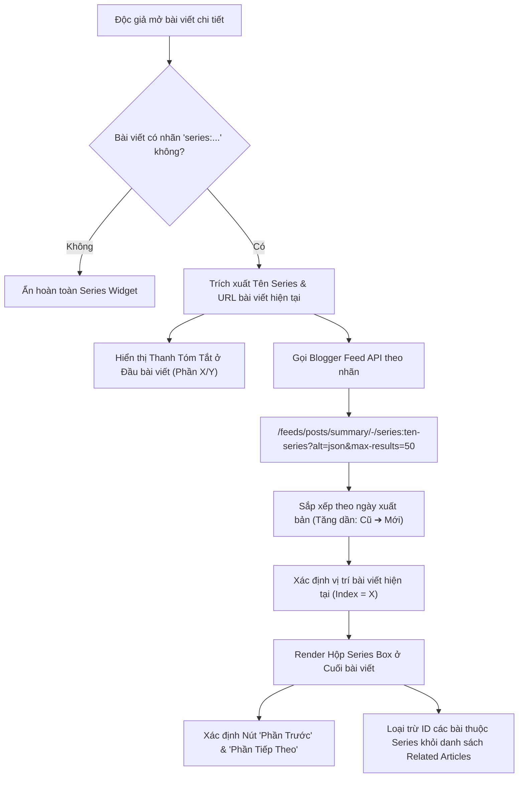

# ĐẶC TẢ KỸ THUẬT & GIAO DIỆN: TÍNH NĂNG CHUỖI BÀI VIẾT (POST SERIES NAVIGATOR)

> **Mã tính năng**: `FEAT-POST-SERIES-V1`  
> **Dự án**: Blogger Editorial Theme (Blogspot XML v3)  
> **Phiên bản đặc tả**: `v1.0.0`  
> **Trạng thái**: Bản thảo thiết kế (Design Specification)  
> **Tương thích**: Blogger Engine 2026, Responsive Mobile/Desktop, Hỗ trợ Song ngữ (VI/EN) & Dark Mode

---

## 1. TỔNG QUAN & MỤC ĐÍCH

### 1.1. Bối cảnh thực tế
Trên blog cá nhân và các chuyên trang kiến thức (Substack, Medium, Viblo, Dev.to), các tác giả thường xuyên xuất bản các bài viết chuyên sâu được chia làm nhiều kỳ:
* *Ví dụ*: "Tự Do Tài Chính Tuổi 30 (Phần 1, 2, 3)", "Nhập Môn Triết Học Cho Người Bận Rộn (Kỳ 1, 2, 3, 4)".

**Vấn đề của cách làm thủ công:**
1. **Tốn công bảo trì:** Mỗi khi ra bài mới (ví dụ Phần 4), tác giả phải quay lại các bài cũ (Phần 1, 2, 3) để dán link bổ sung thủ công.
2. **Thiếu tính định hướng (User Flow):** Độc giả đọc xong Phần 1 không có nút bấm rõ ràng để nhảy sang Phần 2, làm tăng tỷ lệ thoát trang (Bounce Rate).
3. **Dễ nhầm lẫn với "Bài viết liên quan":** Bài viết liên quan (Related Articles) chỉ là các bài viết ngẫu nhiên cùng chủ đề lớn, không có tính thứ tự trước/sau (sequential).

### 1.2. Mục tiêu giải pháp
Xây dựng tính năng **Post Series Navigator** tự động hóa 100% dựa trên tiền tố nhãn (Label Prefix) `series:`:
1. **Tự động gom nhóm & Sắp xếp:** Tự động phát hiện bài viết thuộc chuỗi, sắp xếp từ bài cũ nhất (Phần 1) đến bài mới nhất (Phần N).
2. **Cập nhật hai chiều thời gian thực:** Khi đăng Phần mới, tất cả các phần trước đó tự động có liên kết đến phần mới mà không cần sửa bài cũ.
3. **Trải nghiệm đọc liền mạch (Reading Journey):** 
   * Đầu bài có thanh tóm tắt vị trí (`Phần 2 / 5`).
   * Cuối bài có Hộp lộ trình (Series Roadmap Box) với nút kêu gọi hành động nổi bật: `[👉 Đọc tiếp Phần 3 »]`.
4. **Không xung đột với mục "Bài viết liên quan":** Tự động loại trừ các bài viết trong chuỗi ra khỏi mục Related Articles để tránh trùng lặp nội dung.

---

## 2. QUY ƯỚC QUẢN TRỊ NỘI DUNG (CONTENT AUTHORING CONVENTION)

Tác giả chỉ cần tuân thủ **duy nhất 1 quy tắc gắn nhãn khi đăng bài trên Blogger**:

### 2.1. Cú pháp nhãn Series
* Cú pháp: `series:[Tên_Chuỗi_Bài]`
* *Ví dụ cụ thể*:
  * `series:Tự Do Tài Chính` (hoặc `series:tu-do-tai-chinh`)
  * `series:Nhập Môn AI` (hoặc `series:nhap-mon-ai`)
  * `series:Hành Trình Tối Giản`

### 2.2. Cơ chế lọc nhãn trên giao diện
* Tiền tố `series:` được hệ thống nhận diện riêng cho tính năng này.
* Hệ thống tự động **loại bỏ nhãn `series:...` khỏi danh sách thẻ chuyên mục hiển thị công khai** (cùng nhóm với các nhãn hệ thống như `@featured`, `@timeline`, `ai:...`), đảm bảo giao diện bài viết không bị rối mắt.

### 2.3. Quy tắc xác định thứ tự Phần (Part Numbering)
* Hệ thống tự động sắp xếp các bài viết trong cùng Series theo **thời gian xuất bản tăng dần (Cũ nhất ➔ Mới nhất)**:
  * Bài đăng đầu tiên = **Phần 1**
  * Bài đăng thứ hai = **Phần 2**
  * Bài đăng thứ N = **Phần N**
* *Trường hợp tác giả muốn đổi thứ tự:* Chỉ cần chỉnh lại ngày giờ xuất bản (Published Date) của bài viết trong trình quản trị Blogger.

---

## 3. KIẾN TRÚC KỸ THUẬT & DỮ LIỆU (DATA ARCHITECTURE)

### 3.1. Dòng dữ liệu (Data Pipeline)



### 3.2. Caching & Hiệu năng
* Dữ liệu các bài trong series được lưu tạm vào `sessionStorage['series_' + seriesSlug]` để khi người đọc chuyển từ Phần 1 sang Phần 2, widget hiển thị tức thì trong `0.01 giây` mà không cần gọi lại mạng.
* Script chạy bất đồng bộ (`async / passive`), không làm ảnh hưởng điểm Google PageSpeed hay tốc độ tải nội dung chính.

---

## 4. THIẾT KẾ GIAO DIỆN & VỊ TRÍ (UI/UX SPECIFICATION)

### 4.1. Bố cục tổng thể trên trang bài viết (Single Post Flow)

```text
┌─────────────────────────────────────────────────────────────┐
│ 1. Tiêu đề bài viết (H1)                                     │
├─────────────────────────────────────────────────────────────┤
│ 2. Tác giả • Ngày đăng • Thời gian đọc                      │
├─────────────────────────────────────────────────────────────┤
│ ⭐ VỊ TRÍ 1: THANH TÓM TẮT CHUỖI BÀI (Series Header Pill)   │
│    📖 Chuỗi bài: Tự Do Tài Chính • Phần 2/4 [Xem lộ trình ▾] │
├─────────────────────────────────────────────────────────────┤
│ 3. Nội dung bài viết (Post Body)                             │
├─────────────────────────────────────────────────────────────┤
│ ⭐ VỊ TRÍ 2: HỘP LỘ TRÌNH CHUỖI BÀI (Series Roadmap Box)    │
│    ┌───────────────────────────────────────────────────┐    │
│    │ 📚 LOẠT BÀI: TỰ DO TÀI CHÍNH                      │    │
│    │ Tiến độ: Đang đọc Phần 2 / 4 [████░░░░] 50%       │    │
│    │                                                   │    │
│    │  01. Xây dựng thói quen tiết kiệm          [Đã đọc]│   │
│    │  02. Đầu tư thụ động cho người mới     👉 Đang đọc│   │
│    │  03. Quản trị rủi ro & danh mục         [Chưa đọc]│   │
│    │  04. Độc lập tài chính ở tuổi 30        [Chưa đọc]│   │
│    │                                                   │    │
│    │ [« Phần 1: Tiết kiệm]  [👉 ĐỌC TIẾP PHẦN 3 »]      │    │
│    └───────────────────────────────────────────────────┘    │
├─────────────────────────────────────────────────────────────┤
│ 4. Nút Chia sẻ (Share) & Giới thiệu tác giả (Bio)           │
├─────────────────────────────────────────────────────────────┤
│ 5. 📚 BÀI VIẾT LIÊN QUAN (Đã lọc trừ các bài trong series)  │
│    [Thẻ bài A]        [Thẻ bài B]        [Thẻ bài C]        │
├─────────────────────────────────────────────────────────────┤
│ 6. Khung Bình luận & Đăng ký bản tin                        │
└─────────────────────────────────────────────────────────────┘
```

---

### 4.2. Chi tiết từng Component

#### Component A: Thanh Tóm Tắt Đầu Bài (Series Header Pill)
* **Vị trí**: Nằm ngay dưới hàng tác giả/ngày đăng, phía trên khối nội dung bài viết.
* **Giao diện**:
  * Dạng thanh capsule bo góc mềm, nền `var(--bg-surface)` có viền mảnh `var(--stroke-hairline)`.
  * Huy hiệu nổi bật: `[SERIES]` (màu `--primary` trên nền dịu).
  * Văn bản: `Chuỗi bài viết: [Tên Series] • Phần X / Y`.
  * Nút tương tác: `[Xem các phần ▾]` ➔ Khi bấm sẽ mượt mà cuộn trang (smooth scroll) xuống đúng Hộp Lộ Trình ở chân bài viết.

#### Component B: Hộp Lộ Trình Chân Bài (Post Series Box)
* **Vị trí**: Nằm ngay khi người đọc vừa đọc xong dòng cuối cùng của bài viết (trước mục Share và Tác giả).
* **Cấu trúc bao gồm 4 phần con**:
  1. **Series Header & Progress**:
     * Tiêu đề chuỗi bài nổi bật với biểu tượng cuốn sách 📚.
     * Thanh tiến trình nhỏ (Progress Bar) thể hiện tỷ lệ hoàn thành (ví dụ: `2/4 phần - 50%`).
  2. **Danh sách các phần (Part Step Items)**:
     * Mỗi phần hiển thị số thứ tự trang nhã: `01`, `02`, `03`...
     * **Trạng thái bài đã qua:** Đổi màu dịu, có icon checkmark `✓`.
     * **Trạng thái bài đang đọc (Active):** Được bọc nền màu nhấn `var(--primary-light)`, viền nổi bật, có huy hiệu `👉 Bạn đang đọc`.
     * **Trạng thái bài tiếp theo:** Có liên kết bấm chuyển trang ngay.
  3. **Cặp nút điều hướng nhanh (Prev/Next Quick Action)**:
     * Nút bên trái: `« Phần trước: [Tiêu đề vắn tắt]` (nền xám nhạt).
     * Nút bên phải (Call-To-Action chính): `👉 Đọc tiếp Phần X+1: [Tiêu đề] »` (nút nổi bật với hiệu ứng gradient và bóng mờ).
  4. **Nút thu gọn / mở rộng (Collapse/Expand)**:
     * Nếu chuỗi bài dài hơn 5 phần, danh sách mặc định hiển thị bài trước, bài hiện tại và bài tiếp theo, kèm nút `[Xem toàn bộ 8 phần ▾]` để không chiếm quá nhiều diện tích trang.

---

## 5. TƯƠNG TÁC GIỮA SERIES VÀ "RELATED ARTICLES" (TRÁNH XUNG ĐỘT)

Đây là điểm khác biệt cốt lõi đảm bảo sự chuyên nghiệp của blog:

| Tiêu chí so sánh | Hộp Series (Chuỗi bài) | Bài viết liên quan (Related Articles) |
| :--- | :--- | :--- |
| **Bản chất** | Chuỗi bài học / Chuyên đề nhiều kỳ | Khám phá ngẫu nhiên các bài viết cùng chuyên mục |
| **Thứ tự** | Nghiêm ngặt theo thời gian (Phần 1 ➔ Phần N) | Bài mới nhất hoặc phổ biến nhất |
| **Dạng giao diện** | Dạng danh sách lộ trình / Timeline dọc + Nút Next lớn | Dạng lưới 3 cột hình ảnh thẻ ngang (Thumbnail Grid) |
| **Vị trí** | Ngay dưới chân nội dung bài viết | Dưới phần Tác giả và Nút Share |
| **Cơ chế lọc trùng** | Hiển thị tất cả bài trong `series:...` | **Tự động lọc bỏ các bài đã xuất hiện trong Series** |

* **Quy tắc lọc trùng (Deduplication Rule):**
  Khi mục *Related Articles* quét các bài cùng nhãn chuyên mục (ví dụ `Tài Chính`), script sẽ so sánh URL với danh sách URL đã có trong Hộp Series. Bất kỳ bài viết nào đã nằm trong Hộp Series sẽ **bị bỏ qua**, đảm bảo khu vực Related Articles chỉ gợi ý các bài viết mới lạ khác.

---

## 6. HỖ TRỢ SONG NGỮ (VI/EN) & GIAO DIỆN TỐI (DARK MODE)

### 6.1. Từ điển I18n đa ngôn ngữ
Tích hợp tự động vào orchestrator đa ngôn ngữ hiện có (`src/scripts/bilingual.js`):

```javascript
const SERIES_I18N = {
  vi: {
    seriesBadge: 'Loạt bài',
    seriesTitlePrefix: 'Chuỗi bài viết:',
    partPrefix: 'Phần',
    readingNow: 'Bạn đang đọc',
    readPart: 'Đọc phần này',
    readNext: 'Đọc tiếp phần sau »',
    readPrev: '« Phần trước',
    progressText: 'Tiến độ:',
    viewAllParts: 'Xem toàn bộ các phần',
    collapseParts: 'Thu gọn danh sách',
    scrollDownToSeries: 'Xem lộ trình ▾'
  },
  en: {
    seriesBadge: 'Series',
    seriesTitlePrefix: 'Article Series:',
    partPrefix: 'Part',
    readingNow: 'You are reading',
    readPart: 'Read this part',
    readNext: 'Next part »',
    readPrev: '« Previous part',
    progressText: 'Progress:',
    viewAllParts: 'View all parts',
    collapseParts: 'Collapse list',
    scrollDownToSeries: 'View roadmap ▾'
  }
};
```

### 6.2. Thiết kế Dark Mode
* Sử dụng hoàn toàn Design Tokens CSS có sẵn (`--bg-surface`, `--bg-card`, `--border-color`, `--primary`, `--text-main`, `--text-muted`).
* Độ tương phản đạt chuẩn WCAG AA, bảo vệ mắt người đọc vào ban đêm.

---

## 7. CÁC TÌNH HUỐNG BIÊN (EDGE CASES)

1. **Chuỗi mới chỉ có duy nhất 1 bài (Vừa đăng Phần 1, chưa có Phần 2):**
   * Thanh đầu bài hiển thị: `Loạt bài: [Tên Series] • Phần 1`.
   * Hộp chân bài thông báo nhẹ nhàng: `✨ Phần tiếp theo đang được tác giả biên soạn. Hãy đăng ký bản tin để nhận thông báo sớm nhất!`.
2. **Bài viết thông thường không gắn nhãn `series:...`:**
   * Cả 2 component (Thanh đầu bài & Hộp chân bài) hoàn toàn không render vào DOM, không ảnh hưởng bất kỳ điều gì đến bài viết.
3. **Mạng chậm hoặc lỗi Feed API:**
   * Hệ thống tự động fallback ẩn hộp Series trong im lặng, không làm đơ hay giật giao diện bài đọc.

---

## 8. LỘ TRÌNH TRIỂN KHAI (IMPLEMENTATION ROADMAP)

* **Giai đoạn 1**: Xây dựng module trích xuất nhãn Series trong `scripts/build.js` và template XML v3.
* **Giai đoạn 2**: Viết logic xử lý dữ liệu và render động trong `src/scripts/post-series.js` (hoặc tích hợp vào `reading-time.js`).
* **Giai đoạn 3**: Thiết kế hệ thống CSS chuẩn Editorial trong `src/styles/post-series.css`.
* **Giai đoạn 4**: Tích hợp cơ chế lọc trùng (deduplication) vào `initRelatedPosts()`.
* **Giai đoạn 5**: Kiểm thử tương thích trên `preview.html`, biên dịch `node scripts/build.js` và xác thực trên Blogger thực tế.
