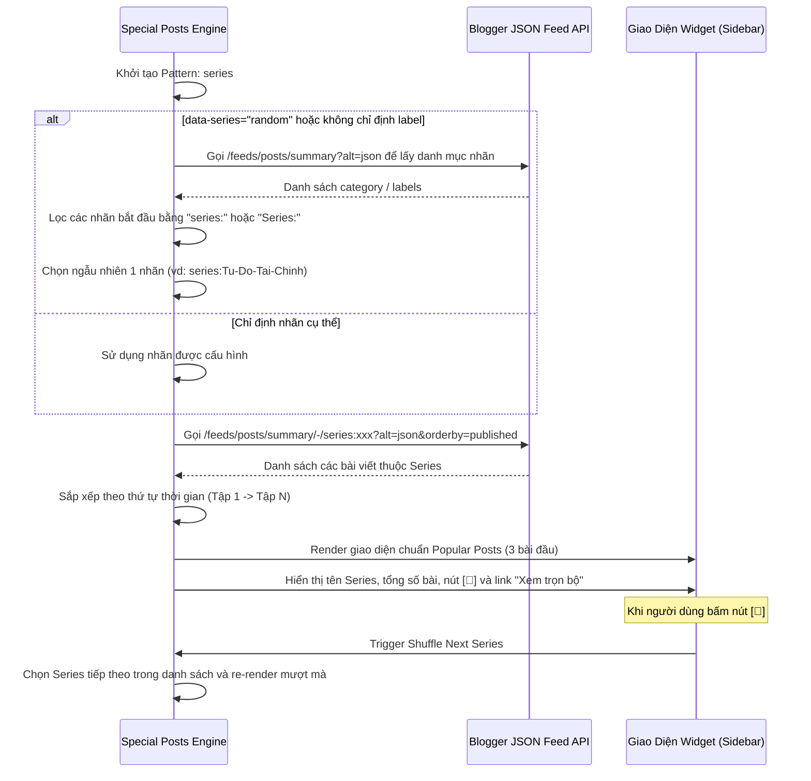

# ĐẶC TẢ KỸ THUẬT: TIỆN ÍCH TUYẾN BÀI CHỌN LỌC ĐỘC LẬP (STANDALONE SERIES SHOWCASE WIDGET)

- **Mã spec:** DONE_018 | **Phiên bản:** 1.0.0 | **Trạng thái:** Done | **Ngày:** 18/09/2026
- **Dự án:** Trà Đá Blog (Blogger Editorial Theme - Blogspot XML v3)
- **Tài liệu tham chiếu:** [01_Done_007_Flexible_Special_Posts_Widget_Specification.md](file:///Users/nam.truong/Documents/Viber%20Coding/blogspot-editorial-theme/specs/01_Done_007_Flexible_Special_Posts_Widget_Specification.md), [01_Done_013_Post_Series_Navigator_Specification.md](file:///Users/nam.truong/Documents/Viber%20Coding/blogspot-editorial-theme/specs/01_Done_013_Post_Series_Navigator_Specification.md), [04_Idea_017_Editorial_Theme_Backlog_And_Widget_Enhancements_Specification.md](file:///Users/nam.truong/Documents/Viber%20Coding/blogspot-editorial-theme/specs/04_Idea_017_Editorial_Theme_Backlog_And_Widget_Enhancements_Specification.md)

---

## 1. MỤC TIÊU & BỐI CẢNH

Hiện tại, hệ thống đã có tính năng **Post Series Navigator (Lộ trình đọc chuỗi bài)** nhưng chỉ hiển thị bên trong bài viết thuộc chuỗi đó. Độc giả đang ở ngoài Trang chủ hoặc đang đọc các bài viết độc lập sẽ không biết tác giả có các bộ chuyên đề nhiều kỳ tâm huyết.

**Mục tiêu của Spec này:**
1. Xây dựng một **Widget độc lập (Standalone Series Showcase Widget)** có thể đặt linh hoạt tại **Cột bên (Sidebar)** hoặc **Xen kẽ luồng bài viết (In-feed)**.
2. Mỗi lần tải trang, widget tự động chọn **ngẫu nhiên một Series (Random Series)** từ kho chuyên đề của blog để giới thiệu.
3. Trang bị nút **🔀 Đổi Tuyến Bài** trực tiếp ngay trên header widget để độc giả có thể chuyển sang khám phá series khác mà không cần tải lại trang.
4. Hiển thị rõ tên chuyên đề và **tổng số bài viết** có trong series.
5. Số lượng bài hiển thị: Mặc định là **3 bài** (cho phép cấu hình linh hoạt từ `3` đến `10`).
6. Nếu Series có nhiều hơn số bài giới hạn (ví dụ series 8 bài nhưng hiển thị 3 bài), dưới chân widget sẽ có đường dẫn **"Xem trọn bộ (8 bài) »"** dẫn đến trang lọc toàn bộ bài thuộc series đó.
7. **Quy chuẩn thị giác (UI Consistency):** Kế thừa 100% phong cách giao diện của widget **"🔥 Bài Viết Nổi Bật" (Popular Posts)** hiện có (số thứ tự `01, 02, 03` mờ lớn, ảnh thumbnail vuông bo góc 60x60, tiêu đề 2 dòng, ngày đăng, đường kẻ phân cách nội bộ dưới tiêu đề widget).

---

## 2. THIẾT KẾ GIAO DIỆN (UI/UX SPECIFICATION)

### 2.1. Mockup Bố cục Visual (Kế thừa Popular Posts Style)

```text
┌─────────────────────────────────────────────────────────────┐
│ 📚 TUYẾN BÀI CHỌN LỌC                                [🔀]  │
│ ─────────────────────────────────────────────────────────── │  <-- Đường kẻ nằm trong padding widget
│ 📖 "The Law of 'Union and Separation'"                      │
│ 🏷️ Tuyển tập 3/3 bài viết                                   │
│                                                             │
│ 01   [Ảnh 60x60]  The Law of "Union and Separation" - P1    │
│                   📅 tháng 9 13, 2026                       │
│                                                             │
│ 02   [Ảnh 60x60]  The Law of "Union and Separation" - P2    │
│                   📅 tháng 9 14, 2026                       │
│                                                             │
│ 03   [Ảnh 60x60]  The Law of "Union and Separation" - P3    │
│                   📅 tháng 9 14, 2026                       │
│                                                             │
│                            [ ︾ ]                            │
└─────────────────────────────────────────────────────────────┘
```

### 2.2. Các thành phần chi tiết

1. **Khung chứa Widget (`.sidebar-widget`):**
   - Nền `var(--bg-card)`, bo góc `var(--radius-lg)`, viền `var(--border-color)`, padding `1.5rem`.
2. **Tiêu đề Widget (`.sidebar-widget-title`):**
   - Tiêu đề mặc định: `📚 Chuyên Đề | 📚 Series Topic`.
   - Bên phải: Nút Shuffle `🔀` (button tròn nhỏ, hover xoay nhẹ và đổi màu primary).
   - Dưới chân tiêu đề: Đường kẻ `border-bottom: var(--stroke-thick) solid var(--border-color)` nằm gọn bên trong phạm vi padding của widget.
3. **Khối tóm tắt Series (`.series-showcase-summary`):**
   - Tên Series: Chữ đậm `font-size: 0.88rem`, trích xuất sạch sẽ từ nhãn (bỏ tiền tố `series:`), hỗ trợ text-overflow ellipsis khi tên dài.
   - Huy hiệu tổng số bài: Badge pill bên phải `3/X bài viết | 3/X topics`.
4. **Danh sách bài viết (`.popular-posts-list`):**
   - Sử dụng chung lớp CSS `.popular-posts-list` và `.popular-post-item` của Popular Posts.
   - Số thứ tự: `.popular-post-num` (`01`, `02`, `03` font to 1.35rem, font-weight 900, màu viền mờ).
   - Thumbnail: `.popular-post-thumb` kích thước `60px x 60px`, `border-radius: var(--radius-sm)`, object-fit cover.
   - Nội dung: Tiêu đề giới hạn 2 dòng (`-webkit-line-clamp: 2`), ngày xuất bản dạng `📅 tháng X ngày Y, năm Z`.
5. **Chân Widget (`.series-showcase-footer`):**
   - Triệt tiêu hoàn toàn khoảng trống thừa ở đáy widget (`margin-bottom: -0.65rem; border-top: none`).
   - Icon hai mũi tên kép hướng xuống (Double Chevron Down `︾`) nét dày `2.8`, kích thước `26px x 26px`, to rõ ràng và nổi bật.
   - Hover nhích nhẹ xuống dưới (`translateY(3px)`), kèm tooltip *"Xem trọn bộ chuyên đề (X bài)"*.
   - URL liên kết: `/search/label/${encodeURIComponent(seriesLabel)}`.

---

## 3. KIẾN TRÚC KỸ THUẬT & TÍCH HỢP HỆ THỐNG

### 3.1. Tích hợp vào Engine `special-posts.js` (Pattern `series`)

Thay vì viết một script riêng lẻ làm nặng trang, tính năng này được tích hợp trực tiếp dưới dạng **Pattern thứ 5** trong `src/scripts/special-posts.js`:

```javascript
const PATTERN_RENDERERS = {
  ranked:    renderRankedPattern,
  spotlight: renderSpotlightPattern,
  quote:     renderQuotePattern,
  digest:    renderDigestPattern,
  series:    renderSeriesPattern, // Pattern mới
};
```

### 3.2. Cấu hình linh hoạt qua Blogger Layout

Tác giả chỉ cần thêm một tiện ích **HTML/JavaScript** trong Bố cục Blogger với cú pháp đơn giản:

#### Trường hợp 1: Ngẫu nhiên Series (Mặc định khuyên dùng)
```text
pattern: series | limit: 3 | random: true
```
*(Widget sẽ tự động quét danh sách series hiện có và bốc ngẫu nhiên 1 series khi tải trang)*.

#### Trường hợp 2: Ghim cố định 1 Series đang muốn quảng bá
```text
pattern: series | label: series:The-Law-Of-Union | limit: 5
```

### 3.3. Thuật toán xử lý dữ liệu (Workflow)



---

## 4. KẾ HOẠCH TRIỂN KHAI (IMPLEMENTATION PLAN)

### 4.1. File mã nguồn cần chỉnh sửa

| Thao tác | Tên file | Mục đích |
| :--- | :--- | :--- |
| **[MODIFY]** | [src/scripts/special-posts.js](file:///Users/nam.truong/Documents/Viber%20Coding/blogspot-editorial-theme/src/scripts/special-posts.js) | Bổ sung `renderSeriesPattern()`, hàm lấy danh sách nhãn series và hàm shuffle |
| **[MODIFY]** | [src/styles/post-layout.css](file:///Users/nam.truong/Documents/Viber%20Coding/blogspot-editorial-theme/src/styles/post-layout.css) | Thêm CSS cho `.series-shuffle-btn`, `.series-showcase-summary`, `.series-showcase-footer` |
| **[MODIFY]** | [src/components/sidebar.xml](file:///Users/nam.truong/Documents/Viber%20Coding/blogspot-editorial-theme/src/components/sidebar.xml) | Thêm widget HTML mẫu `HTML18` với `pattern: series` vào Sidebar bên dưới PopularPosts |
| **[MODIFY]** | [src/preview.html](file:///Users/nam.truong/Documents/Viber%20Coding/blogspot-editorial-theme/src/preview.html) | Bổ sung mock HTML trong Sidebar để kiểm thử trực tiếp trên Live Preview |

### 4.2. Kế hoạch kiểm thử (Verification Plan)
1. **Kiểm thử trên `preview.html` (`npm run dev`):**
   - Mở Sidebar, kiểm tra widget hiển thị đúng phong cách card của "Bài Viết Nổi Bật".
   - Kiểm tra đường kẻ phân cách nội bộ dưới tiêu đề.
   - Nhấp nút `🔀` xem danh sách bài có chuyển đổi mượt mà sang series khác hay không.
   - Kiểm tra hiển thị tổng số bài (`3/X bài`) và nút *"Xem trọn bộ chuyên đề »"*.
2. **Kiểm thử đóng gói (`npm run build`):**
   - Build ra `dist/theme.xml` đảm bảo không phát sinh lỗi biên dịch và không gây giật layout (CLS = 0).
