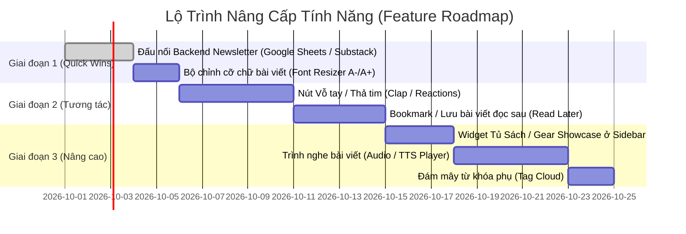

# ĐẶC TẢ Ý TƯỞNG & BACKLOG NÂNG CẤP TÍNH NĂNG BLOG (EDITORIAL WIDGETS & ENGAGEMENT BACKLOG)

- **Mã spec:** IDEA_017 | **Phiên bản:** 1.0.0 | **Trạng thái:** Idea | **Ngày:** 18/09/2026
- **Dự án:** Trà Đá Blog (Blogger Editorial Theme - Blogspot XML v3)
- **Tài liệu tham chiếu:** [01_Done_001_Theme_Specification.md](file:///Users/nam.truong/Documents/Viber%20Coding/blogspot-editorial-theme/specs/01_Done_001_Theme_Specification.md), [01_Done_007_Flexible_Special_Posts_Widget_Specification.md](file:///Users/nam.truong/Documents/Viber%20Coding/blogspot-editorial-theme/specs/01_Done_007_Flexible_Special_Posts_Widget_Specification.md), [01_Done_008_Modular_Footer_Specification.md](file:///Users/nam.truong/Documents/Viber%20Coding/blogspot-editorial-theme/specs/01_Done_008_Modular_Footer_Specification.md), [01_Done_013_Post_Series_Navigator_Specification.md](file:///Users/nam.truong/Documents/Viber%20Coding/blogspot-editorial-theme/specs/01_Done_013_Post_Series_Navigator_Specification.md), [01_Done_014_Subway_Timeline_Archive_Specification.md](file:///Users/nam.truong/Documents/Viber%20Coding/blogspot-editorial-theme/specs/01_Done_014_Subway_Timeline_Archive_Specification.md)

---

## 1. TỔNG QUAN & BỐI CẢNH

Giao diện **Trà Đá Blog (`blogspot-editorial-theme`)** được định hình theo phong cách **Editorial Profile Theme** (kết hợp giữa tạp chí hiện đại và blog định vị thương hiệu cá nhân phong cách Substack / Medium / X).

Sau quá trình rà soát và đối chiếu toàn diện với các chuẩn mực widget trên các nền tảng blog/tạp chí hiện nay, giao diện hiện tại đã sở hữu nền tảng kiến trúc rất mạnh mẽ:
- Chuẩn SEO 100% với Schema JSON-LD và Heading động.
- Hệ thống điều hướng & khám phá nội dung cao cấp (Subway Timeline, Post Series Navigator, Spotlight Hero, Special Posts Ranked).
- Hệ sinh thái trải nghiệm đọc hiện đại (Zero-FOUC Dark Mode, Song ngữ VI/EN, AI Transparency, Auto TOC, Reading Time).

Tài liệu này lưu trữ kết quả phân tích khoảng trống (Gap Analysis) và quy hoạch danh mục tính năng chờ (Feature Backlog) để tác giả lên kế hoạch phát triển theo từng giai đoạn.

---

## 2. MA TRẬN ĐỐI CHIẾU HIỆN TRẠNG (AS-IS VS. TO-BE CHECKLIST)

| STT | Hạng mục Widget / Tính năng | Hiện trạng (As-Is) | Đánh giá | Nhu cầu nâng cấp (To-Be) |
| :---: | :--- | :--- | :---: | :--- |
| **1** | **Bản tin Email (Newsletter)** | Đã có UI ở 3 vị trí (Sidebar, In-feed cuối bài, Footer) | ⚠️ Chưa có backend | Đấu nối xử lý submit form thực tế (Substack / Google Sheets / Mailchimp) |
| **2** | **Tương tác nhanh (Micro-reaction)** | Chỉ có khung bình luận Blogger | ❌ Thiếu | Bổ sung nút Vỗ tay / Thả tim (Clap / Reaction Button) không cần login |
| **3** | **Lưu bài viết (Bookmark)** | Chưa có | ❌ Thiếu | Tính năng Lưu bài đọc sau (Read Later) lưu trên `localStorage` |
| **4** | **Nghe bài viết (Audio / TTS)** | Chưa có | ❌ Thiếu | Trình nghe bài viết Web Speech API hoặc Embed Player |
| **5** | **Khả năng tiếp cận (Accessibility)** | Cỡ chữ cố định theo theme tokens | ⚠️ Cơ bản | Nút điều chỉnh cỡ chữ nhanh (Font Resizer A- / A+) |
| **6** | **Tủ sách / Vật dụng (Affiliate Gear)** | Đã có CSS Callout/Review trong bài | ⚠️ Chưa có widget | Thêm widget chuyên dụng ở Sidebar giới thiệu Sách/Vật dụng khuyên dùng |
| **7** | **Đám mây từ khóa (Tag Cloud)** | Đã có thanh Category Tabs chính | ⚠️ Chỉ có tab lớn | Thêm khối Hashtags / Tags đám mây chi tiết ở Sidebar hoặc Footer |
| **8** | **Đa tác giả (Multi-Author)** | Thiết kế cố định cho 1 tác giả | ℹ️ Chủ đích | Tùy chọn override Bio theo thẻ tác giả nếu có bài Guest Post |

---

## 3. DANH MỤC BACKLOG CHI TIẾT (FEATURE SPECIFICATIONS)

### 📌 Epic 1: Tương Tác & Giữ Chân Độc Giả (Engagement & Retention)

#### [IDEA-01] Đấu nối Backend thực tế cho Form Bản Tin (Newsletter Backend Integration)
- **Mức độ ưu tiên:** 🔴 Cao (Quick Win)
- **Vị trí áp dụng:** 
  - Sidebar (`HTML4`)
  - Kết luồng bài viết (`HTML12` Pre-pagination Newsletter)
  - Footer Tier 1 (`HTML9`)
- **Vấn đề hiện tại:** Các form hiện đều chặn gửi với `onsubmit="return false;"`, độc giả nhập email nhưng hệ thống không thu thập được data.
- **Giải pháp đề xuất:**
  - *Phương án A (Khuyên dùng - 0đ):* Tạo một Google Apps Script Web App làm webhook. Khi độc giả nhấn Đăng Ký, JavaScript `fetch()` gửi email lên Google Sheet của tác giả kèm timestamp.
  - *Phương án B:* Hỗ trợ nhúng thẳng `action` URL của **Substack** hoặc **Buttondown** / **Mailchimp** thông qua thuộc tính cấu hình trong Blogger Layout.
  - Hiển thị Toast thông báo thành công: *"Cảm ơn bạn! Đã ghi nhận đăng ký bản tin thành công."*

#### [IDEA-02] Nút Vỗ tay / Thả tim tương tác nhanh (Clap / Emoji Reactions Widget)
- **Mức độ ưu tiên:** 🟡 Trung bình
- **Vị trí áp dụng:** Cuối bài viết (cạnh hộp chia sẻ `post-bottom-share`) hoặc thanh dính bên lề (floating sticky bar).
- **Vấn đề giải quyết:** Độc giả lười đăng nhập để viết bình luận qua Blogger iframe. Nút Clap giúp họ bày tỏ sự yêu thích tức thì chỉ bằng một cú nhấp chuột.
- **Giải pháp đề xuất:**
  - Hiển thị icon 👏 (hoặc ❤️, 💡, ☕) kèm số lượt vỗ tay hiện tại.
  - Cho phép 1 độc giả có thể vỗ tay tối đa 10–20 lần (giống Medium).
  - Backend lưu trữ: Sử dụng **Firebase Realtime Database** (gói Spark miễn phí) hoặc **Cloudflare KV / Supabase** theo Post ID/URL.
  - Hiệu ứng micro-animation: Các hạt icon bay lên khi click liên tục.

---

### 📌 Epic 2: Tiện Ích Trải Nghiệm Đọc Chuyên Sâu (Enhanced Reading UX)

#### [IDEA-03] Tính năng Lưu bài viết đọc sau (Bookmark / Read Later)
- **Mức độ ưu tiên:** 🟡 Trung bình
- **Vị trí áp dụng:** 
  - Icon bookmark nhỏ trên góc mỗi thẻ bài viết (`post-card`).
  - Nút Bookmark cạnh tiêu đề bài viết đơn lẻ (`single-post-container`).
  - Menu hoặc nút trên Header mở danh sách "Bài viết đã lưu".
- **Giải pháp đề xuất:**
  - Lưu danh sách `{ url, title, date, thumb }` vào `localStorage` của trình duyệt người dùng (không cần cơ sở dữ liệu server).
  - Modal hoặc Drawer trượt ra liệt kê danh sách các bài đã đánh dấu, có nút "Xóa khỏi danh sách" hoặc "Xóa tất cả".

#### [IDEA-04] Trình đọc bài viết tự động (Audio / Text-to-Speech Player)
- **Mức độ ưu tiên:** 🟢 Thấp (Tính năng nâng cao)
- **Vị trí áp dụng:** Ngay bên dưới tiêu đề bài viết và post-meta (trên phần mục lục bài viết).
- **Giải pháp đề xuất:**
  - *Tùy chọn 1 (Native Web Speech API - 0đ, Client-side):* Sử dụng giọng đọc có sẵn của trình duyệt (`window.speechSynthesis`). Có nút Play/Pause, tốc độ đọc 1x/1.25x/1.5x.
  - *Tùy chọn 2 (Podcast Embed):* Nếu bài viết có audio thu sẵn, hỗ trợ thẻ nhúng Spotify / Apple Podcasts hoặc file MP3 từ Google Drive.

#### [IDEA-05] Bộ chỉnh cỡ chữ bài đọc (Font Resizer Accessibility)
- **Mức độ ưu tiên:** 🔴 Cao (Quick Win, Dễ làm)
- **Vị trí áp dụng:** Đặt trong thanh công cụ chia sẻ bài viết hoặc đầu mục lục.
- **Giải pháp đề xuất:**
  - 2 nút bấm: `A-` (Giảm cỡ chữ) và `A+` (Tăng cỡ chữ) điều chỉnh trực tiếp `font-size` của `.post-body` theo 3 mức: Nhỏ (16px) - Mặc định (18px) - Lớn (20px).
  - Ghi nhớ tùy chọn vào `localStorage`.

---

### 📌 Epic 3: Khám Phá Nội Dung & Thương Mại Hóa (Discovery & Monetization)

#### [IDEA-06] Widget Sidebar "Tủ Sách / Đồ Nghề Khuyên Dùng" (Gear & Book Showcase)
- **Mức độ ưu tiên:** 🟡 Trung bình
- **Vị trí áp dụng:** Cột bên Sidebar (thêm vào [src/components/sidebar.xml](file:///Users/nam.truong/Documents/Viber%20Coding/blogspot-editorial-theme/src/components/sidebar.xml)).
- **Mục tiêu:** Tăng doanh thu Affiliate tự nhiên (sách, bàn làm việc, tai nghe, ấm pha trà...) gắn liền với phong cách sống của tác giả.
- **Giải pháp đề xuất:**
  - Tạo 1 widget HTML linh hoạt:
    - Hiển thị ảnh bìa sản phẩm / sách.
    - Tiêu đề & tác giả / nhà sản xuất.
    - Đoạn trích dẫn 1 câu review ngắn của tác giả.
    - Nút CTA: *"Xem tại Tiki"* / *"Xem tại Shopee"* kèm cờ đánh dấu tài trợ minh bạch.

#### [IDEA-07] Đám mây từ khóa phụ (Detailed Tag Cloud Widget)
- **Mức độ ưu tiên:** 🟢 Thấp
- **Vị trí áp dụng:** Chân Sidebar hoặc Footer.
- **Giải pháp đề xuất:**
  - Hiển thị danh sách các nhãn nhỏ hơn dạng Cloud Pills (lọc bỏ các nhãn hệ thống như `@`, `ai:`, `series:`).
  - Giúp độc giả dễ dàng tìm kiếm các bài viết thuộc ngách nhỏ mà thanh menu chính chưa bao quát hết.

---

## 4. LỘ TRÌNH THỰC HIỆN PHÂN KỲ (IMPLEMENTATION ROADMAP)

### Chi tiết phân kỳ:

1. **Giai đoạn 1: Quick Wins (Ưu tiên số 1 - Triển khai ngay)**
   - Hoàn thiện luồng đăng ký Newsletter thực tế (không để form rỗng).
   - Bổ sung nút tăng giảm cỡ chữ bài đọc (`A- / A+`).
2. **Giai đoạn 2: Tăng tương tác & Giữ chân (Ưu tiên số 2)**
   - Nút vỗ tay / thả tim bài viết (Clap Button).
   - Bookmark lưu bài đọc sau (Read Later) bằng `localStorage`.
3. **Giai đoạn 3: Trải nghiệm chuyên sâu & Affiliate (Ưu tiên số 3)**
   - Widget Tủ sách / Món đồ khuyên dùng ở Sidebar.
   - Trình đọc bài bằng giọng nói (Audio TTS).
   - Đám mây từ khóa (Tag Cloud).

---

## 5. KẾT LUẬN & HƯỚNG DẪN BẮT ĐẦU

File spec này đóng vai trò là kho ý tưởng quy chuẩn (`Idea`). Khi quyết định triển khai bất kỳ tính năng nào:
1. Tạo một file spec chi tiết tương ứng (ví dụ: `Draft_018_Newsletter_Backend_Integration_Specification.md`).
2. Chuyển trạng thái sang `Open` -> `Doing` -> `Done` theo quy chuẩn [spec-naming](file:///Users/nam.truong/Documents/Viber%20Coding/blogspot-editorial-theme/.agents/skills/spec-naming/SKILL.md).
3. Đóng gói và kiểm thử trên `preview.html` trước khi build ra `dist/theme.xml`.
