# ĐẶC TẢ KỸ THUẬT: CƠ CHẾ TÁC GIẢ KHÁCH & TRANG LIÊN HỆ GỬI BÀI VIẾT (DYNAMIC GUEST AUTHOR & CONTACT SUBMISSION PAGE)

- **Mã spec:** DOING_020 | **Phiên bản:** 1.0.0 | **Trạng thái:** Doing | **Ngày:** 21/09/2026
- **Dự án:** Trà Đá Blog (Blogger Editorial Theme - Blogspot XML v3)
- **Tài liệu tham chiếu:** [01_Done_001_Theme_Specification.md](file:///Users/nam.truong/Documents/Viber%20Coding/blogspot-editorial-theme/specs/01_Done_001_Theme_Specification.md), [01_Done_014_Subway_Timeline_Archive_Specification.md](file:///Users/nam.truong/Documents/Viber%20Coding/blogspot-editorial-theme/specs/01_Done_014_Subway_Timeline_Archive_Specification.md), [04_Idea_017_Editorial_Theme_Backlog_And_Widget_Enhancements_Specification.md](file:///Users/nam.truong/Documents/Viber%20Coding/blogspot-editorial-theme/specs/04_Idea_017_Editorial_Theme_Backlog_And_Widget_Enhancements_Specification.md)

---

## 1. TỔNG QUAN & MỤC TIÊU DỰ ÁN (OVERVIEW & OBJECTIVES)

### 1.1. Bối cảnh & Vấn đề tồn tại
Giao diện **Trà Đá Blog** hiện tại được xây dựng theo phong cách **Editorial Profile & Thought Leadership**. Trong quá trình vận hành và mở rộng cộng đồng người viết, blog phát sinh hai bài toán quan trọng:

1. **Khung thông tin tác giả (Author Bio Box) đang bị "gắn chết" với chủ blog:**
   - Trong `src/template.xml` (dòng 529-574), khung thông tin cuối bài viết (`#post-author-bio-container`) đang bóc tách avatar và bio giới thiệu từ widget Sidebar `#HTML2` của chủ blog.
   - Nếu bài viết do một tác giả khách (Guest Writer) hoặc cộng tác viên đóng góp, hệ thống chỉ đổi được tên tác giả (`data:post.author.name`), còn **ảnh đại diện và đoạn bio vẫn hiển thị thông tin của chủ blog**, gây hiểu lầm và thiếu sự tôn trọng đối với tác giả đóng góp.
   - Nền tảng Blogger (Blogspot) không có cơ chế hồ sơ tác giả khách ảo nếu người đó không có tài khoản quản trị Google được mời vào blog.

2. **Chưa có kênh tiếp nhận bài viết cộng tác chuyên nghiệp:**
   - Hiện tại blog chỉ có form đăng ký nhận bản tin qua email (Newsletter), chưa có kênh hay giao diện để độc giả, bạn bè hoặc chuyên gia gửi bài viết cộng tác về cho ban biên tập.
   - Widget biểu mẫu liên hệ (`ContactForm`) mặc định của Blogspot có giao diện rất cũ kỹ, chỉ hỗ trợ 3 trường thô sơ (`name`, `email`, `message`), không đáp ứng được quy trình gửi bài viết chuyên nghiệp.

### 1.2. Mục tiêu kỹ thuật cốt lõi
1. **Phần 1 - Dynamic Guest Author Engine (Cơ chế Tác giả Khách linh hoạt):**
   - Cho phép nhúng metadata của tác giả khách ngay trong nội dung HTML của bài viết qua thẻ HTML ẩn (`.guest-author-meta`) hoặc JSON metadata.
   - Theme tự động bóc tách và ghi đè thông tin hiển thị tại:
     + Metadata đầu bài viết (`.author-meta-inline`): Tên, avatar nhỏ, nhãn "Cộng tác viên / Guest Author".
     + Khung hồ sơ cuối bài viết (`.author-bio-box`): Avatar lớn, tên, chức danh/danh xưng, đoạn bio giới thiệu (hỗ trợ song ngữ VI/EN), các liên kết mạng xã hội / website cá nhân.
     + Cập nhật Schema.org JSON-LD `Person` tương ứng để tối ưu SEO.
   - **Cơ chế Fallback an toàn:** Nếu bài viết không có thẻ metadata khách, theme giữ nguyên 100% cơ chế hiển thị hồ sơ chính chủ Trà Đá Blog như hiện tại.

2. **Phần 2 - Dedicated Contact & Guest Post Page (Trang Liên Hệ & Gửi Bài Độc Lập):**
   - Xây dựng một trang riêng biệt `/p/lien-he.html` (hoặc `/p/contact.html`) theo cơ chế nhận diện trang tương tự như trang *Dòng Thời Gian (`Subway Timeline`)*.
   - Thiết kế bố cục chuẩn phong cách **Editorial 2 cột** (Desktop) / **1 cột** (Mobile):
     + **Cột trái:** Lời ngỏ từ ban biên tập, tôn chỉ nội dung, quy định gửi bài và quyền lợi của tác giả khách.
     + **Cột phải:** Biểu mẫu gửi bài tương tác (Interactive Submission Form) với giao diện hiện đại, tinh tế, đồng bộ Dark Mode.
   - Biểu mẫu hỗ trợ 2 mục đích linh hoạt (Toggle Tabs):
     + **"Gửi bài viết đóng góp" (Guest Post Submission):** Đầy đủ các trường: Bút danh, Email, Bio giới thiệu, Tiêu đề bài viết, Bản thảo nội dung hoặc link Google Docs, Link ảnh avatar/mạng xã hội.
     + **"Liên hệ hợp tác / Góp ý" (General Contact):** Dành cho độc giả nhắn tin thông thường hoặc đối tác liên hệ công việc.
   - **Backend gửi dữ liệu đa năng (Multi-adapter Backend):**
     + *Adapter A (Blogger Native ContactForm):* Đóng gói payload có cấu trúc và gửi qua `contact-form.do` về Gmail chủ blog (chi phí 0đ, không phụ thuộc dịch vụ ngoài).
     + *Adapter B (Google Apps Script Webhook - Khuyên dùng):* Bắn dữ liệu về Google Apps Script để vừa gửi Gmail, vừa tự động lưu dòng mới vào Google Sheet quản lý duyệt bài.
     + *Adapter C (FormSubmit / Web3Forms):* Tùy chọn cấu hình chỉ bằng 1 dòng email.

---

## 2. KIẾN TRÚC & QUY TRÌNH HOẠT ĐỘNG (SYSTEM ARCHITECTURE & WORKFLOWS)

### 2.1. Quy trình tổng thể

```mermaid
flowchart TD
    subgraph "Kênh 1: Độc giả gửi bài (Frontend Submission)"
        A["Độc giả truy cập /p/lien-he.html"] --> B["Điền Form Gửi Bài Viết\n(Tên, Email, Bio, Tiêu đề, Nội dung/Doc Link)"]
        B --> C["Client-side Validation & Payload Packaging"]
        C --> D{"Chọn Adapter Backend"}
        D -->|"Blogger Native"| E1["Blogger contact-form.do\n-> Email Gmail Admin"]
        D -->|"Google Apps Script"| E2["GAS Webhook\n-> Lưu Google Sheets & Báo Gmail"]
        D -->|"FormSubmit / Web3Forms"| E3["FormSubmit API\n-> Email Gmail Admin"]
    end

    subgraph "Kênh 2: Ban biên tập đăng bài & Render Tác giả"
        F["Chủ blog nhận bài duyệt\n(qua Gmail / Sheets)"] --> G["Tạo bài viết mới trên Blogger Dashboard"]
        G --> H["Chèn thẻ ẩn .guest-author-meta\nvào nội dung bài viết HTML"]
        H --> I["Xuất bản bài viết (Publish)"]
        I --> J["Độc giả mở xem bài viết chi tiết"]
        J --> K{"Kiểm tra có thẻ\n.guest-author-meta trong bài?"}
        K -->|"CÓ (Guest Author)"| L["Bóc tách thông tin Tác giả Khách\n-> Override Header Meta + Author Bio Box + Social Links"]
        K -->|"KHÔNG (Chính chủ)"| M["Fallback hiển thị Profile Trà Đá Blog\n(như logic hiện tại)"]
    end
```


---

## 3. THIẾT KẾ CHI TIẾT PHẦN 1: DYNAMIC GUEST AUTHOR ENGINE

### 3.1. Chuẩn thẻ Metadata Tác Giả Khách (In-Post Microdata Spec)
Tác giả/Biên tập viên chèn đoạn mã HTML sau vào bất kỳ vị trí nào trong bài viết (khuyên dùng đặt ở cuối cùng của bài viết ở chế độ chỉnh sửa HTML):

```html
<!-- TRÀ ĐÁ BLOG: GUEST AUTHOR METADATA -->
<div class="guest-author-meta" style="display:none;"
     data-author-name="Nguyễn Văn A"
     data-author-role="Kỹ sư phần mềm & Cây bút công nghệ"
     data-author-avatar="https://images.unsplash.com/photo-1534528741775-53994a69daeb?auto=format&fit=crop&w=200&q=80"
     data-author-bio-vi="Yêu thích viết lách, tối ưu hệ thống và văn hóa thưởng trà vỉa hè. Hiện đang nghiên cứu về kiến trúc phần mềm tại Hà Nội."
     data-author-bio-en="Software engineer passionate about systems architecture, technical writing, and Vietnamese iced tea culture."
     data-author-website="https://nguyenvana.dev"
     data-author-facebook="https://facebook.com/nguyenvana"
     data-author-twitter="https://x.com/nguyenvana"
     data-author-linkedin="https://linkedin.com/in/nguyenvana"
     data-author-email="mailto:nguyenvana@gmail.com">
</div>
```

### 3.2. Cấu trúc trường dữ liệu (Data Dictionary)

| Thuộc tính (Attribute) | Kiểu dữ liệu | Bắt buộc | Ý nghĩa hiển thị |
| :--- | :--- | :---: | :--- |
| `data-author-name` | Chuỗi (String) | **Có** | Tên hiển thị của tác giả khách |
| `data-author-avatar` | URL ảnh | Không | Link ảnh chân dung vuông (nếu thiếu sẽ tự tạo avatar chữ cái đầu hoặc avatar mặc định) |
| `data-author-role` | Chuỗi (String) | Không | Chức danh, danh xưng chuyên môn hoặc nhãn "Cộng tác viên" |
| `data-author-bio-vi` | Chuỗi / HTML | **Có** | Lời giới thiệu tiếng Việt ngắn gọn (2-4 câu) |
| `data-author-bio-en` | Chuỗi / HTML | Không | Lời giới thiệu tiếng Anh (phục vụ bộ chuyển ngữ song ngữ VI/EN) |
| `data-author-website` | URL | Không | Link website, portfolio cá nhân |
| `data-author-facebook` | URL | Không | Link trang Facebook cá nhân |
| `data-author-twitter` | URL | Không | Link trang X (Twitter) |
| `data-author-linkedin` | URL | Không | Link hồ sơ LinkedIn |
| `data-author-email` | `mailto:...` | Không | Địa chỉ email liên hệ cộng tác |

### 3.3. Logic xử lý Client-side trong Theme (`src/scripts/author-bio.js`)
1. **Phát hiện ngữ cảnh:** Chỉ kích hoạt khi đang ở trang bài viết đơn (`body.view-item` hoặc `data:view.isPost`).
2. **Tìm kiếm metadata:** `const metaEl = document.querySelector('.post-body .guest-author-meta');`
3. **Nếu tìm thấy `metaEl`:**
   - **Tại Post Header (`.author-meta-inline`):**
     - Đổi tên tác giả thành `metaEl.dataset.authorName`.
     - Thay ảnh đại diện `.author-avatar-sm` thành `metaEl.dataset.authorAvatar`.
     - Thêm một nhãn badge nhỏ: `<span class="author-badge-guest">Khách mời</span>`.
   - **Tại Chân bài (`#post-author-bio-container`):**
     - Thay ảnh đại diện thành `.author-bio-avatar`.
     - Nhãn tiêu đề: Chuyển thành `"Về tác giả khách mời | About guest author"` (tương thích hệ thống song ngữ).
     - Tiêu đề tên: Hiển thị tên kèm vai trò `metaEl.dataset.authorRole`.
     - Nội dung Bio: Render đoạn giới thiệu song ngữ `.lang-vi` và `.lang-en`.
     - Khối liên kết Social (`.author-bio-actions`): Sinh động các nút icon bấm (Website, Facebook, X, LinkedIn, Email) nếu tác giả có cung cấp.
   - **SEO JSON-LD:** Cập nhật hoặc bổ sung node `Person` của Schema.org để bot Google nhận diện chính xác người viết.
4. **Nếu không tìm thấy `metaEl`:**
   - Thực thi logic nguyên bản: Lấy ảnh, bio và liên kết từ widget của chủ blog Trà Đá Blog (`#HTML2` & `#HTML88`).

---

## 4. THIẾT KẾ CHI TIẾT PHẦN 2: TRANG LIÊN HỆ & GỬI BÀI VIẾT (`/p/lien-he.html`)

### 4.1. Điều kiện nhận diện trang trong Blogger XML
Tương tự trang Dòng Thời Gian, cấu trúc điều kiện trong `src/template.xml`:
```xml
<b:if cond='data:view.isPage and (data:blog.url contains &quot;/p/lien-he.html&quot; or data:blog.url contains &quot;/p/contact.html&quot; or data:blog.pageName == &quot;Liên Hệ&quot; or data:blog.pageName == &quot;Contact&quot;)'>
  <!-- GIAO DIỆN TRANG LIÊN HỆ & GỬI BÀI ĐỘC LẬP -->
  <div class='editorial-contact-page' id='editorial-contact-app'>
    ...
  </div>
</b:if>
```

### 4.2. Bố cục giao diện 2 cột (Editorial Split Layout)

#### Cột A: Tôn Chỉ & Hướng Dẫn Cộng Tác (Editorial Manifesto & Guidelines)
- **Tiêu đề lớn:** *"Đồng Hành Cùng Trà Đá Blog"* (Song ngữ: *"Write With Us / Get in Touch"*).
- **Mô tả:** *"Trà Đá Blog luôn chào đón những góc nhìn chân thực, sâu sắc về công nghệ, phong cách sống, kiến trúc phần mềm và những chiêm nghiệm đời thường."*
- **Quy chuẩn gửi bài viết (Submission Checklist):**
  - [x] Nội dung nguyên bản, chưa từng đăng tải độc quyền ở nơi khác.
  - [x] Khuyến khích kèm liên kết Google Docs (chế độ nhận xét) để biên tập nhanh chóng.
  - [x] Tôn trọng bản quyền hình ảnh, trích dẫn nguồn minh bạch.
  - [x] Tác giả được giữ nguyên tên tuổi, gắn link bio cá nhân và quảng bá tới độc giả.
- **Kênh kết nối khác:** Email trực tiếp của ban biên tập, liên kết mạng xã hội chính thức của blog.

#### Cột B: Biểu Mẫu Gửi Bài Đa Năng (Interactive Submission Form)
- **Bộ chuyển chế độ (Mode Tabs):**
  - Tab 1: ✍️ **Gửi bài viết đóng góp (Guest Post)** — Chế độ mặc định.
  - Tab 2: ✉️ **Liên hệ hợp tác / Góp ý (General Message)**.
- **Trường thông tin chế độ Gửi bài viết:**
  1. `Họ tên / Bút danh (*)` (Text input)
  2. `Email liên hệ (*)` (Email input)
  3. `Tiêu đề bài viết dự kiến (*)` (Text input)
  4. `Link Google Docs hoặc Nội dung bản thảo (*)` (Textarea lớn / URL input)
  5. `Giới thiệu ngắn về bạn (Bio 1-2 câu)` (Textarea ngắn)
  6. `Link ảnh chân dung / Avatar (Tùy chọn)` (URL input)
  7. `Website hoặc Link Mạng Xã Hội (Tùy chọn)` (URL input)
- **Nút hành động (CTA):**
  - Nút bấm chính: `Gửi bản thảo bài viết` (Kèm spinner loading khi đang gửi).
  - Khung phản hồi: Toast thông báo *"Cảm ơn bạn! Bài viết đã được gửi tới hòm thư ban biên tập. Chúng mình sẽ phản hồi qua email trong vòng 24-48 giờ."*
  - Trường bẫy Spam (Honeypot): `input[name="_honey"]` ẩn, bot spam điền vào sẽ tự động bị hủy gửi.

---

## 5. HỆ THỐNG WIDGET & CALL-TO-ACTION (CTA) MỜI CỘNG TÁC (GUEST POST CTAS & PLACEMENT CONFIGURATION)

Để dẫn luồng độc giả từ các trang bài viết / trang chủ sang trang `/p/lien-he.html`, theme trang bị sẵn các điểm chạm (touchpoints) CTA mời cộng tác.

> [!IMPORTANT]
> **Quy chuẩn cấu hình Mặc Định (Default Display Rules):**
> - **Vị trí 1 (Banner Profile Hero): MẶC ĐỊNH HIỂN THỊ (Default: Visible)** để tạo cặp đôi nút hành động cân đối chuẩn Editorial bên cạnh nút Bản tin. Nếu chủ blog muốn ẩn thì có thể đổi thành `display:none;` trong `#HTML88`.
> - **Các vị trí còn lại (Chân bài viết, Cột bên Sidebar, Menu điều hướng): MẶC ĐỊNH ẨN (Default: Hidden - `display: none`)**, chủ blog có thể chủ động bật lên bất kỳ lúc nào thông qua widget Bố cục Blogger (`#HTML88` - Widget Cấu hình ẩn).

### 5.1. Bốn vị trí CTA được hỗ trợ (Supported Touchpoints)

1. **Vị trí 1: Banner Profile Hero (`.profile-cta-area`) — Cặp đôi nút song song (MẶC ĐỊNH HIỂN THỊ):**
   - **Vị trí:** Nằm ngay cạnh nút `💌 Nhận Bản Tin | Subscribe` trên Banner Hero đầu trang chủ.
   - **Mặc định:** **Hiển thị (`display:inline-flex;`)**.
   - **Giao diện:** Nút Secondary (nền thẻ mờ, viền thanh lịch) phong cách Substack/Medium, hover hiệu ứng nổi bật:
     ```html
     <a class="btn-guest-hero" href="/p/lien-he.html" style="display:inline-flex;" data-bilingual="true">
       ✍️ Viết Cùng Trà Đá | Write With Us
     </a>
     ```
2. **Vị trí 2: Chân bài viết (`.post-footer-actions` / Ngay dưới Author Box) — Mặc định Ẩn:**
   - **Vị trí:** Khối thẻ Callout Strip nằm liền kề bên dưới khung tác giả cuối bài viết.
   - **Mặc định:** Ẩn (`style="display:none;"`).
   - **Khi bật (`display:block;`):** Xuất hiện thẻ mời gọi:
     > ☕ **Bạn có câu chuyện hoặc góc nhìn muốn chia sẻ trên Trà Đá Blog?**  
     > [Gửi bài viết cộng tác ➔] *(Chuyển hướng thẳng tới `/p/lien-he.html`)*
3. **Vị trí 3: Cột bên Sidebar (`.sidebar-wrapper`) — Mặc định Ẩn:**
   - **Vị trí:** Widget Card cố định ở cột bên (Desktop).
   - **Mặc định:** Ẩn (`style="display:none;"`).
   - **Khi bật (`display:block;`):** Hiển thị thẻ giới thiệu chương trình cộng tác viên kèm nút CTA.
4. **Vị trí 4: Thanh điều hướng (Header & Mobile Drawer Menu) — Mặc định Ẩn:**
   - **Vị trí:** Một liên kết/nút nhỏ trên thanh menu chính và trong menu trượt di động.
   - **Mặc định:** Ẩn (`style="display:none;"`).

### 5.2. Cơ chế Cấu hình qua Widget Bố Cục `#HTML88`
Chủ blog không cần chỉnh sửa code nguồn phức tạp. Trong giao diện Blogger Layout > Widget `⚙️ Cấu hình component ẩn (#HTML88)`, cấu hình trực quan như sau:

```html
<!-- 3. Widget Mời Cộng Tác / Gửi Bài Viết -->
<div class="guest-cta-config">
  <!-- Nút trên Banner Hero (MẶC ĐỊNH HIỆN: display:inline-flex, đổi thành display:none nếu muốn tắt) -->
  <a class="btn-guest-hero-config" href="/p/lien-he.html" style="display:inline-flex;">
    <span data-bilingual="true">✍️ Viết cùng Trà Đá | ✍️ Write with us</span>
  </a>

  <!-- Callout chân bài viết (MẶC ĐỊNH ẨN: đổi display:none thành display:block để bật) -->
  <div class="post-guest-callout-config" style="display:none;">
    <span class="callout-text" data-bilingual="true">
      Bạn muốn chia sẻ câu chuyện của mình trên Trà Đá Blog? | Want to share your thoughts on Trà Đá Blog?
    </span>
    <a class="callout-btn" href="/p/lien-he.html">
      <span data-bilingual="true">Gửi bài viết ➔ | Submit article ➔</span>
    </a>
  </div>

  <!-- Widget Sidebar (MẶC ĐỊNH ẨN: đổi display:none thành display:block để bật) -->
  <div class="sidebar-guest-card-config" style="display:none;">
    <h3 class="sidebar-widget-title" data-bilingual="true">✍️ Viết Cùng Chúng Mình | Write With Us</h3>
    <p data-bilingual="true">Chia sẻ góc nhìn chân thực và lan tỏa tri thức tới cộng đồng bạn đọc. | Share your genuine perspectives with our readers.</p>
    <a class="sidebar-cta-btn" href="/p/lien-he.html">Gửi bài ngay | Submit</a>
  </div>
</div>
```

---

## 6. THIẾT KẾ BACKEND ADAPTERS (CƠ CHẾ GỬI MAIL)

Hệ thống hỗ trợ 3 Adapter linh hoạt, cấu hình trực tiếp qua thuộc tính hoặc biến toàn cục `window.__CONTACT_CONFIG`:

```javascript
window.__CONTACT_CONFIG = {
  adapter: 'gas', // 'gas' | 'blogger' | 'formsubmit'
  gasWebhookUrl: 'https://script.google.com/macros/s/.../exec',
  adminEmail: 'namtruong.contact@gmail.com'
};
```

### 5.1. Adapter A: Google Apps Script Webhook (Khuyên dùng - 100% Google Free)
Chủ blog triển khai một Apps Script đơn giản trên tài khoản Google:
```javascript
function doPost(e) {
  try {
    var d = e.parameter;
    var subject = (d.type === 'guest_post') 
      ? "[Bài Viết Mới Gửi Duyệt] " + d.post_title + " - " + d.author_name
      : "[Liên Hệ Mới] Từ " + d.author_name;
    
    // 1. Tạo nội dung email HTML định dạng đẹp
    var body = "<h2>" + subject + "</h2>" +
               "<p><b>Tác giả:</b> " + d.author_name + " (" + d.author_email + ")</p>" +
               "<p><b>Bio:</b> " + (d.author_bio || "Không có") + "</p>" +
               "<p><b>Social / Web:</b> " + (d.author_social || "Không có") + "</p>" +
               "<hr/>" +
               "<h3>Nội dung / Link bản thảo:</h3>" +
               "<div>" + (d.content || "").replace(/\n/g, '<br/>') + "</div>";

    // 2. Gửi mail tới hòm thư chủ blog
    MailApp.sendEmail({
      to: "namtruong.contact@gmail.com",
      subject: subject,
      htmlBody: body
    });

    // 3. Tùy chọn: Lưu vào Google Sheets
    // ...
    
    return ContentService.createTextOutput(JSON.stringify({status: "ok"}))
      .setMimeType(ContentService.MimeType.JSON);
  } catch (err) {
    return ContentService.createTextOutput(JSON.stringify({status: "error", message: err.message}))
      .setMimeType(ContentService.MimeType.JSON);
  }
}
```

### 5.2. Adapter B: Blogger Native ContactForm Integration
Nếu không muốn tạo Apps Script, script sẽ tận dụng endpoint gốc của widget Blogger:
- Gom các trường `Tiêu đề`, `Bio`, `Nội dung` thành chuỗi text có định dạng rõ ràng vào trường `message`.
- Gửi POST request tới:
  ```text
  POST https://www.blogger.com/contact-form.do
  Payload: name, email, message, blogID
  ```
- Blogger tự động gửi email thông báo về Gmail của admin.

---

## 7. DANH SÁCH TẬP TIN & THAY ĐỔI CẦN THỰC HIỆN

| Hành động | Đường dẫn tập tin | Mục đích & Chi tiết thay đổi |
| :--- | :--- | :--- |
| **[NEW]** | `src/scripts/guest-author.js` | Module bóc tách thẻ `.guest-author-meta` và cập nhật động Author Box & Post Header |
| **[NEW]** | `src/scripts/contact-page.js` | Module logic tương tác của trang Liên Hệ & Gửi bài (tabs, validation, gửi email qua adapter) |
| **[NEW]** | `src/styles/contact-page.css` | Giao diện CSS chuẩn Editorial 2 cột, Responsive và Dark Mode cho trang Liên Hệ |
| **[MODIFY]** | `src/components/profile-hero.xml` | Bổ sung nút CTA phụ `btn-guest-hero` (mặc định ẩn `display:none`) cạnh nút Subscribe |
| **[MODIFY]** | `src/components/footer.xml` | Bổ sung khối cấu hình widget ẩn mời cộng tác vào `#HTML88` |
| **[MODIFY]** | `src/template.xml` | - Bổ sung khối XML điều kiện hiển thị trang `/p/lien-he.html`<br>- Nhúng module `guest-author.js` và `contact-page.js`<br>- Tinh chỉnh cấu trúc `author-bio-box` và callout cuối bài |
| **[MODIFY]** | `src/preview.html` | - Thêm chế độ xem trước Trang Liên Hệ (`view-mode-contact`) vào thanh giả lập<br>- Bổ sung bài viết mẫu chứa thẻ `.guest-author-meta` để kiểm thử Author Box |
| **[MODIFY]** | `scripts/build.js` | Tự động bundle các file script và style mới vào `dist/theme.xml` |

---

## 8. KẾ HOẠCH NGHIỆM THU & KIỂM THỬ (VERIFICATION PLAN)

### 7.1. Kiểm thử phần Tác giả Khách (Guest Author Engine)
1. **Bài viết mặc định (Không có thẻ meta):** Đảm bảo hiển thị đầy đủ avatar, tên và bio của Trà Đá Blog như hiện tại, không phát sinh lỗi console.
2. **Bài viết có thẻ `.guest-author-meta`:**
   - Avatar và Tên ở đầu bài (`.author-meta-inline`) đổi sang thông tin tác giả khách kèm badge "Khách mời".
   - Khung `.author-bio-box` cuối bài đổi sang ảnh của khách, tiêu đề "Về tác giả khách mời", đoạn bio của khách và các icon mạng xã hội liên kết chính xác.
3. **Kiểm thử Chuyển ngữ (Song ngữ VI/EN):** Nhấn nút chuyển ngôn ngữ trên Header -> Bio tiếng Việt và Bio tiếng Anh của tác giả khách tự động thay đổi tương ứng.

### 7.2. Kiểm thử phần Trang Liên Hệ (Contact & Submission Page)
1. **Chuyển chế độ (Toggle Tabs):** Bấm qua lại giữa "Gửi bài viết đóng góp" và "Liên hệ thông thường" -> Các trường tương ứng ẩn/hiện mượt mà.
2. **Xác thực biểu mẫu (Validation):** Bỏ trống các trường bắt buộc (`name`, `email`, `content`) -> Báo lỗi trực quan không cho gửi.
3. **Chống Spam (Honeypot):** Điền trường ẩn `_honey` -> Hệ thống từ chối gửi.
4. **Trạng thái gửi (UX Loading & Toast):** Nút gửi hiển thị hiệu ứng xoay (spinner), sau khi thành công hiện thông báo cảm ơn và tự động reset form.
5. **Đồng bộ giao diện:** Kiểm tra hiển thị hoàn hảo ở cả giao diện Sáng (Light) và Tối (Dark), không bị tràn vỡ giao diện trên thiết bị di động (iPhone / Android).
